# 🎥 Studio Rental – Frontend

Frontend web application for managing studio reservations, built with **React**, **TypeScript**, and **Vite**.  
The platform provides a **guided booking flow for users** and a **protected admin area** for managing reservations, availability, and rentals.

---

## 🛠 Tech Stack

- React 19
- TypeScript
- Vite
- Yarn
- React Hook Form
- Material UI (MUI)
- Day.js
- Axios

---

## 🏠 User Experience

### Home Page
- Image slider showcasing the studio
- Step-by-step reservation flow with a vertical stepper

### Reservation Flow
1. **Select Date & Hours**
    - Dynamic availability handling
    - Blocked dates and hours are respected
    - Minimum booking duration enforced
2. **Select Rentable Equipment**
    - Optional lights and accessories
3. **Accept Rules & Conditions**
4. **Submit Reservation**
    - User receives a confirmation notification and email
    - Reservation is created with *pending* status

Form state, validation, and step transitions are handled using **React Hook Form**.

---

## 🧑‍💼 Admin Area

The admin panel allows full control over the booking system.

### Reservations
- View reservations grouped by month
- Accept or deny pending reservations
- Visual indicators for expired or outdated bookings

### Availability Management
- Block **single dates**
- Block **specific hours**
- Block **ranges of dates**
- Updates are reflected instantly in the user booking flow

### Rentals Management
- Create and manage rentable items (e.g. lights)
- Rentals appear dynamically in the user reservation flow

---

## 📸 Screenshots

> _Screenshots are for demonstration purposes._

### User – Home & Reservation Flow
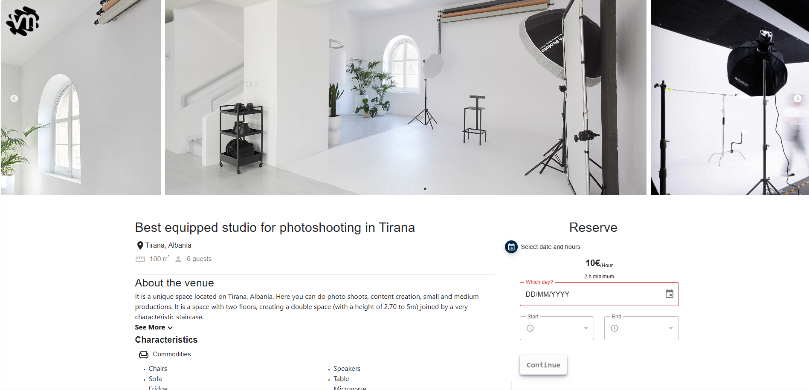

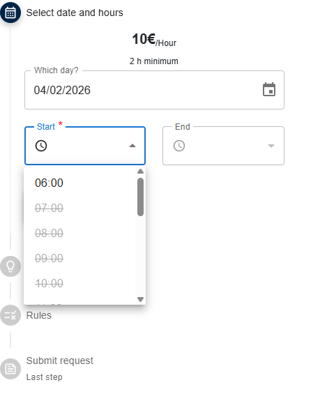
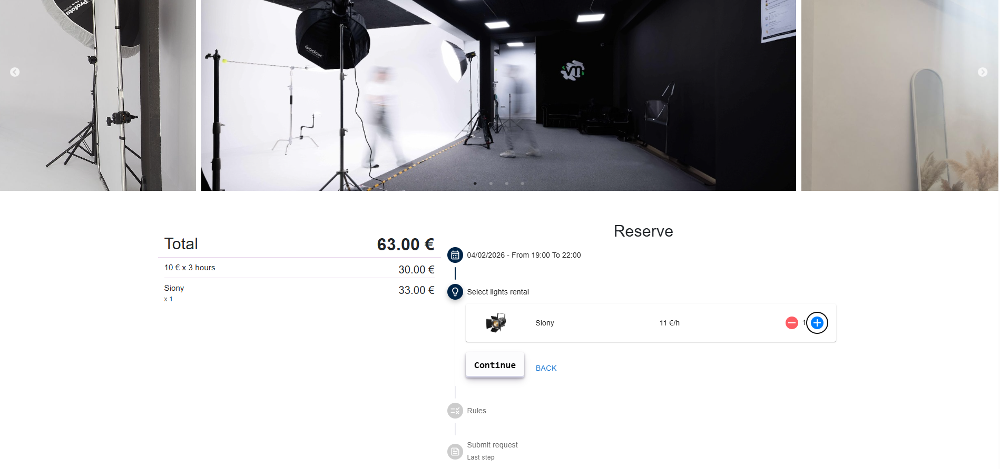
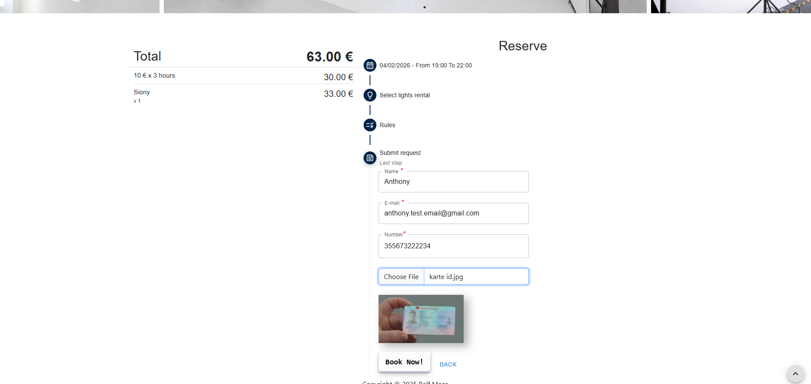

### Admin – Reservations
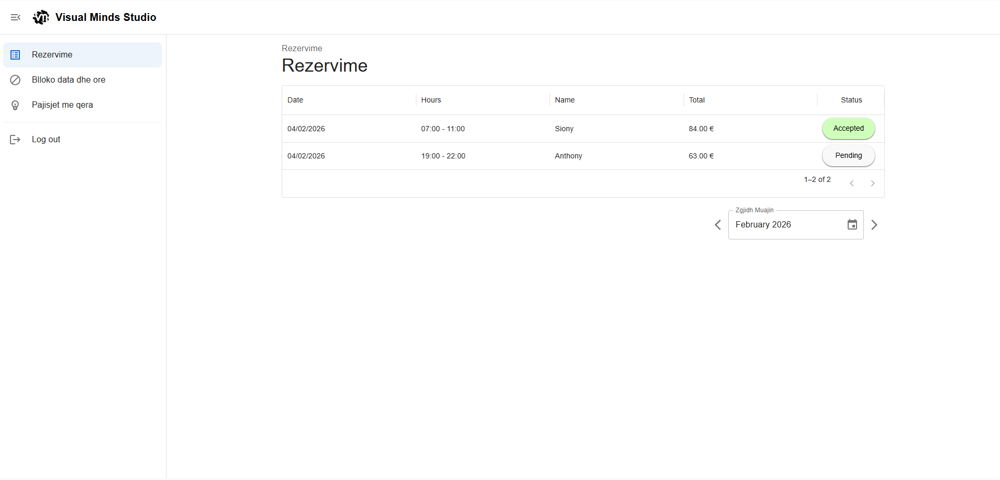
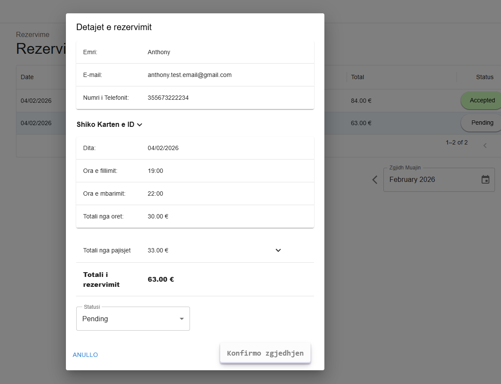

### Admin – Availability 
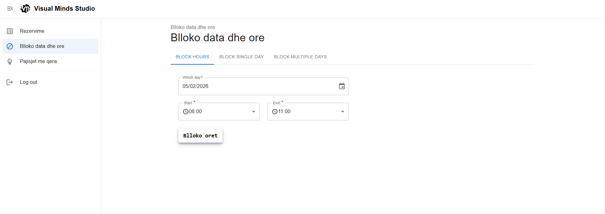
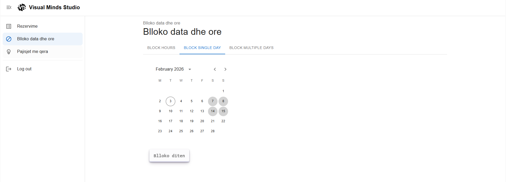
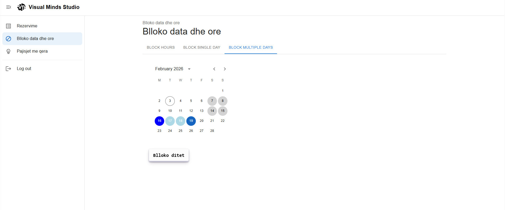
### Admin – Rentals
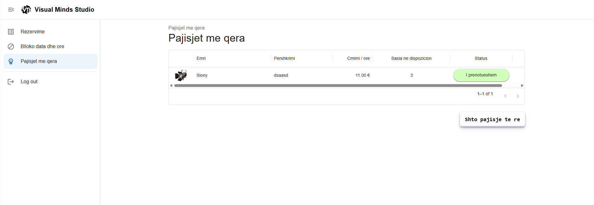
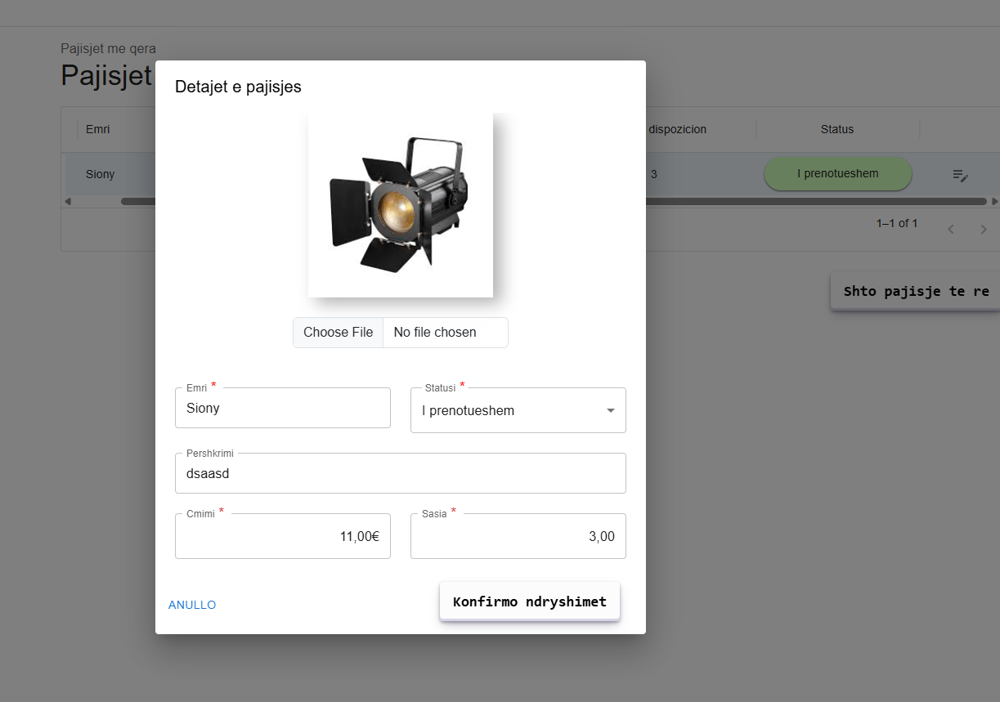

---

## 📊 Data & State Management

- API communication via Axios
- Date handling with Day.js
- Conditional UI states for loading, errors, and disabled actions
- Admin authentication via token stored in `localStorage`

---

## 🚀 Getting Started

```bash
yarn install
yarn dev
```
## 👤 Author

### Ralf Meça

Front-End Developer

React • TypeScript • Data-driven UI